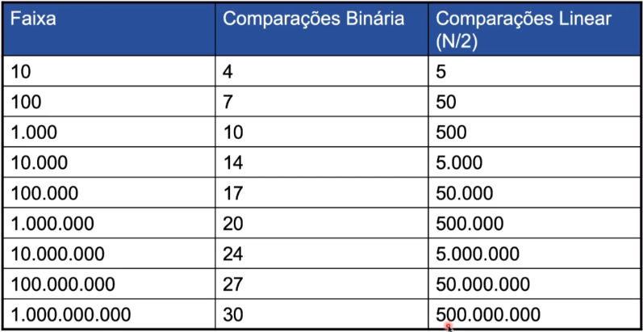

# Estrutura de dados com Python
Curso Estrutura de Dados e Algoritmos em Python: O Guia Completo

Grafos, árvores, listas encadeadas, ordenação, pilhas, filas, deques e mais! Tudo o que você precisa saber!

### Instalação

- Python: http://python.org/
- Anaconda: https://www.anaconda.com/
- PyCharm

#### Vantagem de trabalhar com o Anaconda

Permite criar vários ambientes Python 

## Python

### Módulos úteis

- Biblioteca math
- Biblioteca datetime
- Biblioteca random
- Biblioteca time

### Tratamento de Erros

- NameError: variável não foi definida
- TypeError: tipos de dados incompatíveis
- RuntimeError: erro de execução
- SyntaxError: sintaxe digitada é inválida e não reconhecida pelo interpretador
- ZeroDivisionError: divisão por zero
- IndexError: índice fora da coleção

## Sobre Coleções

#### O que são tuplas?

- Imutáveis (não pode modificar);
- Útil para dados fixos;
- Mais rápido do que as listas;

- `tupla = ('Item 1', 'Item 2', 'Item 3', 'Item 4')`
- `tupla[0] => 'Item 1'`

#### O que são listas?

- Estrutura mais utilizada;
- Pode-se modificar os elementos;
- Aumenta e diminui o tamanho;

- `lista = [1,2,3]`

#### O que são dicionários?

- Pares de chave/valor;
- Array associativo (similar ao HashMap do Java);
- Não ordenado

- `dicionario = {´João´:20, ´Maria´: 30, ´Pedro´: 25}`

#### O que são conjuntos (set)?

- Armazena itens não duplicados;
- Acessa muito mais rápido do que as listas;
- Suporta operações matemáticas (união, intersecção, diferença);
- Não ordenado;

- `conjunto = {1,2,3}`

## Notação Big O

- Como comparar dois algoritmos?
- Comparação objetiva entre algoritmos
- Considera diferenças entre poder de processamento, sistema operacional, linguagem de programação
- O quanto a "complexidade" do algoritmo aumenta de acordo com as entradas

### Funções Bio O

- Constante ` O(1) `
  - É aquela em que não há crescimento do número de operações, pois não depende do volume de dados de entrada (n). Por exemplo: o acesso direto a um elemento de uma matriz.
- Logaritmo ` O(n) `
  - É aquela em que o crescimento do número de operações é menor do que o do número de itens. Exemplo: caso médio do algoritmo de busca em árvores binárias ordenadas.
- Linear ` O(n) `
  - É aquela em que o crescimento no número de operações é diretamente proporcional ao crescimento do número de itens. Por exemplo: o algoritmo de busca em uma lista/vetor.
- Linearitmica ou Quasilinear ` O(n log n) `
  - É aquela em que é resultado das operações (log n) executada n vezes. Exemplo: o caso médio do algoritmo de ordenação Quicksort.
- Quadrática ` O(2^n) `
  - É aquela que ocorre quando os itens de dados são processados aos pares, muitas vezes com repetições dentro da outra. Com dados suficientemente grandes, tendem a se tornar muito ruim. Por exemplo: o processamento de itens de uma matriz bidimensional.
- Exponencial ` O(2^n) `
  - É aquela em que a medida que n aumenta, o fator analisado (tempo ou espaço) aumenta exponencialmente. Não é executável para valores muito grandes e não são úteis do ponto de vista prático. Exemplo: busca em uma árvore binária não ordenada.
- Fatorial ` O(n!) `
  - É aquela em que o número de instruções executadas cresce muito ra pidamente para um pequeno número de dados. Por exemplo: um algoritmo que gere todas as possíveis permutações de uma lista.

## Exemplos de algoritmos e debugs

https://www.cs.usfca.edu/~galles/visualization/Search.html

## Vetores ordenados 

### Pesquisas Linear e Binária

- Pesquisa linear: percorrer elemento por elemento para fazer a comparação
- Pesquisa binária: "dividir para conquistar"

## Pilhas

- Permite acesso a um item de dados: o último item inserido;
- Se o último item for removido, o item anterior ao último inserido poderá ser acessado;
- Aplicações: 
  - Correção de expressões aritméticas, tais como 3 * (4+5);
  - Percorrimento de uma árvore binária;
  - Pesquisa do vértice de um grafo;
  - Microprocessadores com arquitetura baseada em pilhas. Quando um método é chamado, seu endereço de retorno e seus parâmetros são empilhados em uma pilha e quando ele retorna, são desempilhados.

### Operações

- Empilhar:
  - Colocar um item de dados no topo da pilha
- Desempilhar:
  - Remover um item do topo da pilha
- Ver o topo
  - Mostra o elemento que está no topo da pilha 
- Último-a-entrar-primeiro-a-sair (**LIGO** - Last-In-First-Out)

## Filas

- Na fila, o primeiro elemento inserido é o primeiro a ser removido (**FIFO** - First-in-First-out);
- Aplicações:
  - Modelar aviões aguardando para decolar
  - Pacotes de dados esperando para serem transmitidos pela rede

### Operações

- Enfileirar:
  - Colocar um item no final da fila
- Desenfileirar:
  - Remover um item do início da fila
- Ver início da fila
  - Mostrar o elemento que está no início da fila

### Fila circular

### Fila de prioridade

- Os itens são ordenados por valor-chave, de modo que o item com a chave mais baixa/alta esteja sempre na frente;
- Elementos de alta prioridade são colocados no início da fila, elementos de baixa prioridade, são alocados no final da fila;